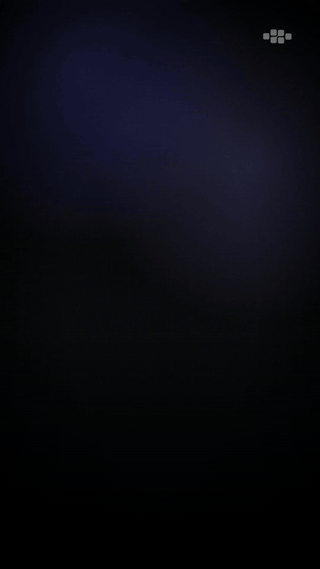
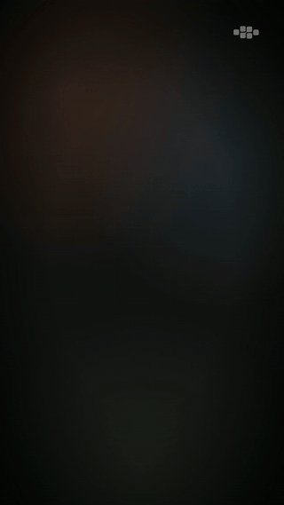

# motion-shorts

[](https://www.youtube.com/@cgaravitoq-ai)
[](./LICENSE)

Turborepo monorepo for producing vertical 9:16 motion-graphics shorts
(YouTube Shorts, LinkedIn, TikTok, Instagram Reels) entirely from text
scripts — [Hyperframes](https://hyperframes.heygen.com/) +
[GSAP](https://gsap.com/) +
[ElevenLabs](https://elevenlabs.io/) (TTS + Scribe STT).

```
script.txt → voice.mp3 + word-level captions.json
                            ↓
   scene-spec.json (typed scenes) → assemble → index.html
                            ↓
        per-scene scene-qa → bunx hyperframes render → mp4 / mov / webm
```

A short is a typed **`scene-spec.json`**, not hand-written HTML. A
deterministic assembler turns the spec into one monolithic, paused
`index.html` (1:1 — identical spec ⇒ identical bytes). `index.html` is
**generated; never hand-edit it**. Scenes are composed from a parametric
**scene-type hub** under `apps/hyperframe/templates/` — a universal
`_shell/` (tokens, background layers, brand-corner watermark, the single
paused GSAP timeline + crossfades, captions/audio, track allocation) plus
24 typed scene-types in `scenes/<type>/v1/`: `hook`, `title-cards`,
`flow`, `fanout`, `metric`, `bars`, `big-stat`, `comparison`, `timeline`,
`quote`, `code`, `social-card`, `progress-ring`, `line-chart`,
`contrib-heatmap`, `decision-tree`, `outro` (the pinned brand sign-off,
always last), plus seven desktop-first asset-led types — `media-split`,
`annotated-asset`, `code-output`, `dashboard-composite`,
`statement-lower-third`, `logo-grid`, and `before-after`.
Repeatable slots have ranges (e.g. `title-cards.cards` 2-6, `flow.steps`
2-6, `metric.stats` 1-4, `timeline.events` 3-6, `code.lines` 1-12).

A short renders 9:16 by default; pass `--format=desktop` to also assemble a
16:9 `index.desktop.html` (rendered with `render:episode --variant=desktop-1080p`),
where the desktop-first types come into their own.

No React, no JSX, no build step. Render is local, single-machine,
headless Chrome + ffmpeg, frame-accurate. See
`apps/hyperframe/src/episodes/` for reference implementations and run
`bun run scene:gallery` to generate an episode exercising every
scene-type. The full e2e playbook is in
[`.agents/skills/canonical-short/SKILL.md`](./.agents/skills/canonical-short/SKILL.md).

## Examples in the wild

Two shorts produced with this pipeline and published on
[**@cgaravitoq-ai**](https://www.youtube.com/@cgaravitoq-ai):

<table>
  <tr>
    <td align="center" width="50%">
      <a href="https://www.youtube.com/shorts/HW0vRlc_nCo">
        
      </a>
      <br/>
      <sub><b>Codex desde el móvil</b> · 54s · <a href="https://www.youtube.com/shorts/HW0vRlc_nCo">YouTube</a></sub>
    </td>
    <td align="center" width="50%">
      <a href="https://www.youtube.com/shorts/aey_LhOTRK8">
        
      </a>
      <br/>
      <sub><b>Claude Code routines</b> · 59s · <a href="https://www.youtube.com/shorts/aey_LhOTRK8">YouTube</a></sub>
    </td>
  </tr>
</table>

More episodes (Claude Code hooks, Codex vs Claude Code, prompt caching,
agentic context engineering, AI engineering harness, …) on the
[YouTube channel](https://www.youtube.com/@cgaravitoq-ai).

## Setup

Requires [Bun](https://bun.sh/) ≥ 1.3, Node ≥ 22, and `ffmpeg` on the
path. ElevenLabs API key needed for TTS + Scribe captions.

```bash
git clone https://github.com/cgaravitoq/motion-shorts.git
cd motion-shorts
bun install                                            # always from repo root
cp .env.example .env                                   # set ELEVENLABS_API_KEY
                                                       # (Notion MCP uses OAuth)
```

This repo is local-first. Specs are assembled, QA'd, and rendered through the
scene-hub scripts, the Hyperframes CLI, or the local stdio MCP server; there is
no maintained production API or worker stack.

## Scene-hub commands

All commands run from `apps/hyperframe/`:

```bash
# Scaffold a starter scene-spec.json + assemble index.html
bun run new:episode <slug> [--intent=informative|data|workflow|social|brand|vfx]

# Regenerate index.html from scene-spec.json (after every spec edit).
# --format=desktop instead writes the 16:9 index.desktop.html.
bun run assemble <slug> [--format=short|desktop]

# Validate scene-spec(s) against the scene-type manifests (no assembly)
bun run scene:check [<spec>...]

# Generate the gallery episode exercising every scene-type
bun run scene:gallery

# Per-scene visual QA: snapshot key frames + inspect overflow/overlap.
# Writes renders/<slug>-qa/<scene-id>/*.png + report.json (no full mp4).
# --scenes re-checks only the scenes you changed.
bun run scripts/scene-qa.ts <slug> [--scenes=id1,id2]

# Final full render (only after per-scene QA approval).
# Add --variant=desktop-1080p to render the 16:9 index.desktop.html.
bun run render:episode <slug> --format=mp4 [--variant=desktop-1080p] [--keep-local]

# TTS + word-level captions
bun run audio examples/<slug>.txt --lang=es --speed=1.0 \
  --pause-sentence=300 --pause-clause=0 --out=public/voice/<slug>
```

## Render an existing demo episode

The demos render out of the box, **with or without** an ElevenLabs API key:

```bash
cd apps/hyperframe
bun run render:episode demo-explainer-blocks --format=mp4
```

- **With `voice.mp3`** under `assets/`: `render-episode.ts` ffprobes it, stamps
  `data-duration` on the stage and the `<audio id="voiceover">` tag, inlines
  `assets/captions.json` for word-level karaoke, and renders with audio.
- **Without `voice.mp3`** (e.g. on a fresh clone with no ElevenLabs key):
  the script warns, **strips the `<audio>` tag**, and uses the stage's
  existing `data-duration` as the silent timeline. You still get a
  fully-animated motion-graphics mp4 — just no narration. Add voice later
  by generating `voice.mp3` and re-running the render.

The working copy lives under `apps/hyperframe/out/episodes/<slug>/`;
`apps/hyperframe/src/episodes/<slug>/` is never mutated. The episode's
`meta.json` carries a `tail` field (default `3`) that pads past
end-of-audio so the brand-card lockup holds long enough to read. Override
per-render with `--tail=<seconds>`. Silent renders ignore `tail` (the
stage `data-duration` is authoritative).

To add narration to a demo: write a short script (`examples/<slug>.txt`),
then run `bun run audio examples/<slug>.txt --lang=es --out=public/voice/<slug>`
and copy `voice.mp3` (and optional `captions.json`) into the episode's
`assets/` dir. See [Author a new episode](#author-a-new-episode) for the
full flow.

Renders are local review artifacts by default, even when R2 is configured. Use
`--upload=r2` only for a final accepted render that should write remote
manifests and persist artifacts to R2. After a verified upload, local render
outputs are deleted by default; add `--keep-local` when you also need the mp4
locally.

### Working-copy semantics (read once before cleaning anything)

`render-episode.ts` builds a self-contained working copy under
`apps/hyperframe/out/episodes/<slug>/` so the canonical episode under
`src/episodes/<slug>/` never gets mutated. The working copy has two symlinks:

- `out/episodes/<slug>/lib` → `src/lib`
- `out/episodes/<slug>/assets` → `src/episodes/<slug>/assets`

The script defends the invariant with explicit guards (refuses to render if
the working-copy path resolves to the source dir or escapes `./out/`), but
**cleanup tools that follow symlinks are the footgun to avoid**. Standard POSIX
`rm -rf out/episodes/<slug>` removes the symlinks themselves and is safe.
Tools like `find … -delete`, `rsync --delete`, and certain Node `fs.rm` configs
can follow symlinks and destroy source files. If in doubt, target the working
copy explicitly with `rm -rf out/episodes/<slug>` and never run symlink-
following cleanup on `out/`.

## Author a new episode

```bash
cd apps/hyperframe

# 1. Scaffold a starter scene-spec.json + assembled index.html. --intent
#    seeds the scene-type spine (vertical 9:16 default).
bun run new:episode my-first-short --intent=workflow

# 2. Write the narration (punctuation drives pacing)
echo "Your voiceover script." > examples/my-first-short.txt

# 3. Generate voice + word-level captions
bun run audio examples/my-first-short.txt --lang=es \
  --speed=1.0 --pause-sentence=300 --pause-clause=0 \
  --out=public/voice/my-first-short

# 4. Listen BEFORE building the visuals (TTS issues are cheap to fix in
#    the script, expensive after rendering)
afplay public/voice/my-first-short/voice.mp3

# 5. Edit src/episodes/my-first-short/scene-spec.json (pick scene-types,
#    fill slots), then validate + regenerate index.html. NEVER edit
#    index.html by hand — it is generated from the spec.
bun run scene:check src/episodes/my-first-short/scene-spec.json
bun run assemble my-first-short

# 6. Per-scene visual QA: snapshot key frames + inspect overflow/overlap.
#    Iterate only the scenes you reject (edit spec → assemble → re-check).
bun run scripts/scene-qa.ts my-first-short
# bun run scripts/scene-qa.ts my-first-short --scenes=hook,flow

# 7. Final render (uses meta.tail = 3 by default; --tail=<s> overrides)
bun run render:episode my-first-short --format=mp4
```

The full e2e playbook (scene-type selection, per-scene QA loop,
brand-corner crossfade, color palettes, TTS pronunciation gotchas) is in
[`.agents/skills/canonical-short/SKILL.md`](./.agents/skills/canonical-short/SKILL.md).

The brand wordmark and tagline default to `cgaravitoq` / `AI Engineering`
(slot defaults in `templates/scenes/outro/v1/manifest.json`, so the demo
episodes render unchanged). To rebrand, set `BRAND_NAME` / `BRAND_TAGLINE`
env vars — `bun run new:episode` writes them into the outro's `wordmark` /
`tagline` slots at scaffold time — or set those slots directly in any
episode's `scene-spec.json`. The logo mark itself is the inline SVG in the
outro fragment and the `#brand-corner` watermark in
`templates/_shell/shell.html.tmpl`; replace both to fully rebrand.

## Layout

```
apps/hyperframe/
  src/episodes/<slug>/   scene-spec.json (authored) + generated index.html
                         + lib symlink
  src/lib/               Shared CSS vars + GSAP helpers + karaoke renderer
  scripts/               assemble / scene-qa / scene:check / new:episode /
                         render:episode / audio / dev
  scripts/lib/           Scene engine: scene-instantiator, assemble-episode,
                         scene-spec, scene-router
  templates/             Parametric scene-type hub:
                           _shell/        Universal look (tokens, bg layers,
                                          brand-corner, paused GSAP timeline,
                                          captions/audio, track allocation)
                           scenes/<type>/v1/  24 scene-types: hook, title-cards,
                                          flow, fanout, metric, bars, big-stat,
                                          comparison, timeline, quote, code,
                                          social-card, progress-ring, line-chart,
                                          contrib-heatmap, decision-tree, outro
                                          + 7 desktop-first: media-split,
                                          annotated-asset, code-output,
                                          dashboard-composite,
                                          statement-lower-third, logo-grid,
                                          before-after
  examples/<slug>.txt    Narration scripts (one per episode)
  public/voice/<slug>/   Canonical audio assets (gitignored, regenerable)
  renders/               Local render + scene-qa cache (gitignored)
  hyperframes.json       paths.episodes: "src/episodes" (relative to app cwd)

packages/audio/          @cgaravitoq/audio — ElevenLabs TTS + Scribe STT,
                         ffprobe, script pacing. In-source TS (no compile).
                         Consumed via "workspace:*".
packages/spec/           @cgaravitoq/spec — Effect-Schema single source of
                         truth for scene-spec + remote manifests, imported
                         across the engine.
packages/publish/        @cgaravitoq/publish — YouTube/TikTok/Instagram
                         upload clients + token/ledger helpers.
packages/r2-client/      R2 upload/manifest helper for render + audio artifacts.
apps/mcp/                Local stdio MCP server: list_scene_types,
                         get_scene_type, recommend_scene_types,
                         validate_scene_spec, assemble_episode, scene_qa,
                         lint_html, generate_audio, render_composition.

.agents/skills/          Source skill files (audio-pipeline, canonical-short,
                         new-episode, produce-from-source, short-*)
.{claude,codex,opencode}/skills/   Symlinks → .agents/skills/<name>

turbo.json               typecheck / test / build / dev / render:episode
.env / .env.example      ELEVENLABS_API_KEY etc. (.env gitignored)
biome.json               Lint/format (TS, JSON; HTML uses hyperframes lint)
tsconfig.json            Base TS config (workspaces extend it)
package.json             workspaces: ["apps/*","packages/*"]
bun.lock                 Single lockfile
AGENTS.md                Conventions, rules, canonical pattern
CLAUDE.md                Symlink → AGENTS.md
```

`AGENTS.md` is the canonical source of truth for conventions.

## Stack

- [Turborepo 2.9.x](https://turborepo.com/) — task orchestration
- [Bun 1.3.x workspaces](https://bun.com/docs/install/workspaces) — package management
- [Hyperframes 0.6.x](https://hyperframes.heygen.com/) — engine + CLI
- [GSAP 3.15.x](https://gsap.com/) — animation, paused timeline
- [`@elevenlabs/elevenlabs-js`](https://elevenlabs.io/docs/api-reference) — TTS + Scribe v2
- [biome](https://biomejs.dev/) + [vitest](https://vitest.dev/)

## License

[MIT](./LICENSE).
